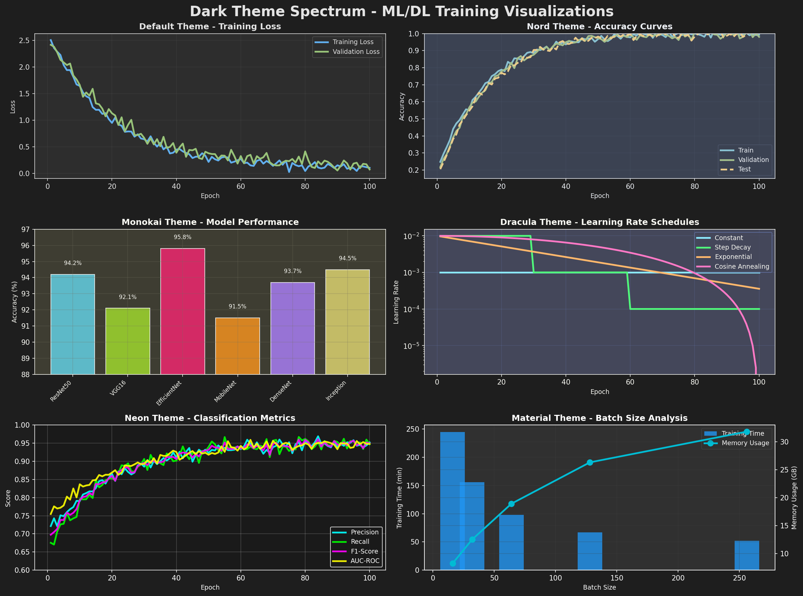

<div align="center">

# matplotlib-dark

***Matplotlib, but in dark mode***

A development tool for applying professional dark themes to matplotlib visualizations. Designed for any type of data visualization, with special optimization for smooth and elegant AI model training plots.

</div>

## Overview



Six dark themes optimized for data visualization:
- **default**: Clean, modern dark theme with excellent contrast
- **nord**: Based on the Nord color palette
- **monokai**: Inspired by the Monokai editor theme
- **dracula**: Using the Dracula theme colors
- **neon**: High-contrast neon colors on dark background
- **material**: Google Material Design color palette

## Installation

Install from source:

```bash
git clone https://github.com/edujbarrios/matplotlib-dark.git
cd matplotlib-dark
pip install -e .
```

## Usage

### Basic Usage

```python
import matplotlib.pyplot as plt
import matplotlib_dark as mdk

# Apply dark theme
mdk.dark_mode()

# Create plots
plt.plot([1, 2, 3, 4], [1, 4, 2, 3])
plt.title("Example Plot")
plt.show()
```

### Selecting Themes

```python
import matplotlib_dark as mdk

# Apply specific theme
mdk.dark_mode(theme='nord')
mdk.dark_mode(theme='monokai')
mdk.dark_mode(theme='dracula')
mdk.dark_mode(theme='neon')
mdk.dark_mode(theme='material')

# Restore default matplotlib style
mdk.light_mode()

# List available themes
themes = mdk.get_available_themes()
```

## Features

- Six professionally designed dark themes
- Single-line activation
- Theme switching capability
- Style restoration to matplotlib defaults
- Full compatibility with matplotlib API

## License

MIT License

## Author

Eduardo J. Barrios ([@edujbarrios](https://github.com/edujbarrios))

